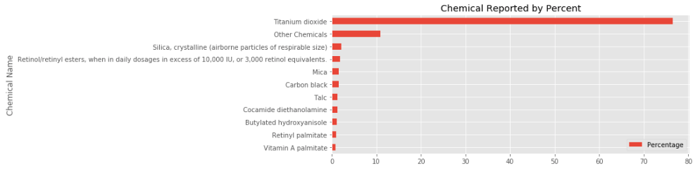
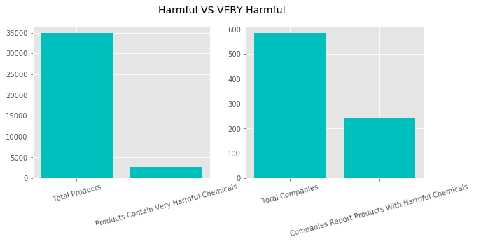
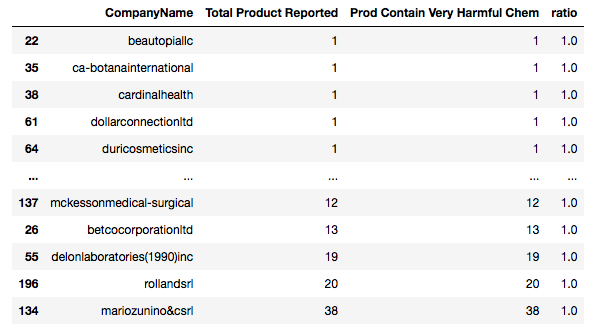
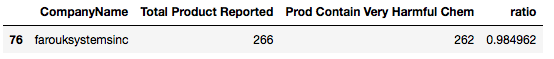
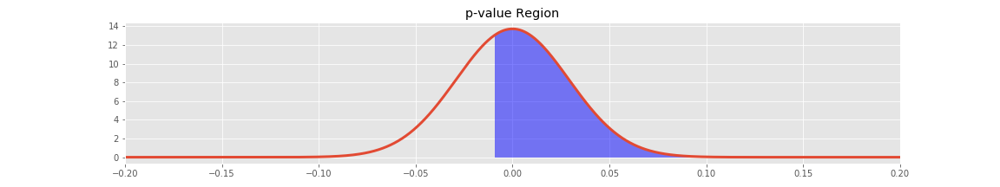
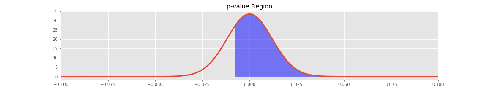

# WhatsOnYourFace

**Presentation Link:** https://docs.google.com/presentation/d/1WirouORE1BTJmqjE8Qd94nHhls4L0t5KmRRavSkZqW8/edit#slide=id.p 

## Motivation
As a data scientist who loves cosmetics, I would like to utilize my skills in finding out what I have been putting on my face for years. I would like to further explore if one chemical is more harmful than the other and if one cosmetic company has a higher chance of using very harmful chemicals ingredients more than other

## Data
The Chemicals in Cosmetics dataset reflects information that has been reported from 2009-2019 to California Safe Cosmetics Program. It includes over 100,000 inputs of cosmetics containing ingredients linked to cancer or reproductive harm reported.

The dataset table consists of 20 columns, but I am only interested in examining the following columns:
- CDPHId (Refers to Product ID) 
- ProductName 
- CSF (Refers to Color/Scent/Flavor)
- CompanyName
- PrimaryCategory
- ChemicalName

**Please note that each product can be input multiple times if it has more than one scent/flavor/color or more than one chemicals
(For more details on the dataset and columns decription, please refer to the *chemicalsincosmetic-dd.xlsx* and *chemicalsincosemetics-description.pdf*)

## Workflow and EDA
- Import data to pandas data frame and cleaned the data, including standardizing the ProductName, CompanyName, and ChemicalName columns and 

- First question that I am eager to find out the answer is 'What is the most frequently reported chemical?'

There are total of 122 unique chemicals reported in this dataset. While most of the chemicals are reported less than 1%, *Titanium dioxide* comes up nearly 80% of all chemicals reported in this dataset, which is even higher than all of the other 121 chemicals combined!

- What I want to find out next is the primary categories that has the highest chemicals reported. To answer this, I group the data by the product ID and primary category and plo 

From the chart above, the most reported category is Makeup Products (non-permanent) and least is baby products, which makes sense since it would be very unethical to put chemicals in the products for babies

- After determining the highest reported chemical and category, I am interested to find out if *Titanium Dioxide* is also highest reported chemical across all primary categories 

**Yellow block** in the chart above refers to *Titanium Dioxide*. This chart evidently shows that *Titanium Dioxide* is the highest reported chemical across almost every primary category. However, this triggers a question if *Titanium Dioxide* is actually very harmful or not if it's most frequently reported

### So, is Titanium Dioxide very harmful?
After some research on *Titanium Dioxide*, I discover that Titanium Dioxide is actually FDA approved. It is also allowed to be used in food. So, my conclusion is that Titanium Dioxide is considered minimally harmful and there are many other much more harmful chemicals compared to it.  

-  Next step I do is categorizing chemicals into **Very Harmful** or not Very Harmful by adding a boolean column to my dataframe. I  determine **Very Harmful** chemicals by comparing the chemicals in the dataset to the **Very Harmful** chemical list I create according to World Health Organization's list of 10 chemicals of major concerns combined with Dirty Dozen Ingredients list by Suzuki Foundation (For more details on the top 10 chemicals of major concerns by WHO, please visit this link https://www.who.int/ipcs/features/chemicals_concern/en/) and for chemicals provided by Suzuki Foundation, please see *dirty-dozen.pdf*)

    - The major **Very Harmful** chemicals includes heavy metals like Lead, Arsenic, Mercury, and Cadmium. These chemicals can cause immediate irritation and some other affects even with low amount of exposure
    - Another chemical that I also consider as **Very Harmful** is "Trade Secret" since the companies are allowed not to disclose the ingredient information, which gives the companies' holders some sort of economic benefit. If the ingredients not very harmful, they could have disclosed the ingredients just like other companies.

    
    

    - Total of 2729 products contain **Very Harmful** chemicals out of 34908 reported products, which is approximately **7%** The number seems pretty low. However...
    - Total of 244 companies reported products contain **Very Harmful** chemical out of 584 reported companies, which is approximately **30%**, which is considered pretty high.

- I, then, calculate the ratio of products containing very harmful chemical to total products reported for each company.

The histogram above reveals that there are a good number of companies that has ratio of 1. So, I dive deeper into the table and find that there are multiple companies that only report either 1 product total or very small amount and of all those reported products contain **Very Harmful** chemical.

For example, *Mckesson Medical-Surgical* only reports 12 products. However, all of those 12 products contain **Very Harmful** chemicals. On the other hands, *Farouk System Inc.* reports 262 harmful products out of 266 reported products. So, I would like to further determine if there is a statistical signifinicant in the ratio difference between 2 companies, which could be a factor in determining which company I should purchase from instead of the other.

## Hypothesis Testing

I am interested in comparing 2 companies in each test. The 2 companies are chosen based on their charateristics. For example, companies that are considered as competitors with similar sizes and products like Anastasia Beverly Hills and Benefit Cosmetic, and 2 completely opposite company types like Chanel Inc. and Amerian International Industries (high end vs low end)

I would like to test
**If there is a statistical significant difference in the ratio of products contain very harmful chemicals to all products reported between 2 companies with 95% confidence? (Alpha = 0.05)**

I am using Two Sample Approximate Test of Population Proportions, assuming that each product that contains **Very Harmful** ingredients is independent of the rest, and the number of products containing **Very Harmful** chemicals are Binomial distributed
    
    H0 : There is no statistical significant difference in the ratio of the 2 companies (P1 = P2)
    
    H1 : There is a statistical significant difference in the ratio of the 2 companies (P1 != P2)

### First Comparison: High End VS Low End
- High End: Chanel Inc. is a French luxury brand. The company reported 6 products contain **Very Harmful** chemicals out of 88 products reported, and the ratio is 0.068182 
- Low End: American International Industries is a drug-store affordable products based company. The company reported 152 products contain **Very Harmful** chemical out of 1964 reported, and the ratio is 0.077393 

- The calculated P-value is ~0.62, which is way over my rejection threshold. Therefore, I am failed to reject the null hypothesis. 
- Conclusion: The difference in proportion between Chanel Inc. and American International Industries is just by randomness. I can’t simply rely on the ratio difference in order to identify which company has more very harmful products more than the other

### Second Comparison: Competitors
- Benefit Cosmetics reported 10 products contain harmful chemicals out of 338 products, and ratio is 0.029586
- Anastasia Beverly Hills LLC reported 31 products contain harmful chemicals out of 824 products, and the ratio is 0.037621

These two companies are pretty similar in sizes, revenues, and products. They both based in California, USA and beauty bloggers usually compare products from the 2 companies.

- The calculated P-value is ~0.75, which is, again, way over my rejection threshold. 
- Conclusion: Again, the difference in proportion between Benefit Cosmetics and Anastasia Beverly Hills is just by randomness. I can’t rely on the ratio difference to identify which one is more harmful than the other

# Future Work
- Classify companies into more categories so I can conduct a test and make a conclusion in a bigger picture rather than 2 companies at a time. For example:
    - Classify companies into higher end VS lower end groups using their average product prices to determine.
    - Classify companies into big VS small company determined by their revenues.
    - Find more parameters/characteristics of the companies that are within my ability to identify

    

