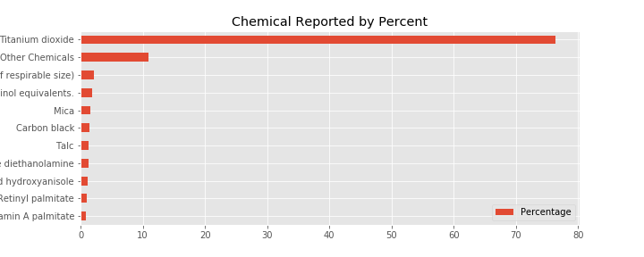

# WhatsOnYourFace

**Presentation Link: https://docs.google.com/presentation/d/1WirouORE1BTJmqjE8Qd94nHhls4L0t5KmRRavSkZqW8/edit#slide=id.p **

## Motivation
As a data scientist who loves cosmetics, I would like to utilize my skills in finding out what have I been putting on my face. I would like to further explore if one chemical is more harmful than the other and if there are any brands or companies that have higher chance of using very harmful chemicals ingredients more than others

## Data
The Chemicals in Costmetics dataset reflect information that has been reported from 2009-2019 to California Safe Cosmetics Program. It includes over 100,000 inputs of cosmetics containing ingredients linked to cancer or reproductive harm reported.

The table consists of 20 columns but interested in examining the following columns:
- CDPHId (Product ID) 
- ProductName 
- CSF (Color/Scent/Flavor)
- Primary Category
- Chemical Name
- Chemical Count

**Please note that each product can be input multiple times if it has more than one scent/flavor/color or more than one chemicals

## Workflow and EDA
- Import data to pandas data frame and clean

- Determine the most reported chemical

Titanium dioxide comes up really high compared to other chemicals. It is nearly 80% of all chemicals reported in this dataset

- Find out the most reported primary categories. To answer this, I grouped the data by the product id and primary category and plot the bar graph. 

From the graph above, the most reported category is Makeup Products (non-permanent) and least is baby products, which makes sense since it would be very unethical to put chemicals to products for babies

- After determining the highest reported chemical and category, I was interested to find out if *Titanium Dioxide* was also highest reported across all primary categories 

    Yellow block refers to *Titanium Dioxide*. This evidently shows that Titanium Dioxide has been reported the most across all primary categories. However, this triggers a question if *Titanium Dioxide* is actually very harmful or not if it's most frequently reported

After some research on *Titanium Dioxide*, I discovered that Titanium Dioxide is actually FDA approved. Although it is considered harmful, but there are other chemicals that are much more compared to it.  

-  Next step I did was to categorize chemicals into **Very Harmful** or not Very Harmful according to World Health Organization's list of 10 chemicals of major concerns and I combined this list with Dirty Dozen Ingredients investigated in Suzuki Foundation
    - The major **Very Harmful** chemicals includes heavy metals like Lead, Arsenic, Mercury, and Cadmium. These chemicals can cause immediate affect even with low amount of exposure
    - Another chemical that I also consider as **Very Harmful** is "Trade Secret" since the companies are allowed not to disclose the ingredient information, which gives the companyies' holders some sort of economic benefit. If the ingredients not very harmful, they could have disclosed the ingredients just like other companies.

    

    - total of 2729 products contain **Very Harmful** chemicals out of 34908 reported products
    - total of 244 companies reported products contain **Very Harmful** chemical out of 584 reported companies

- Calculating ratio very harmful product to total products reported for each company

The histogram shows that there are a good number of companies that has ratio of 1. So, I dive deeper into the table and found that ther are multiple companies that only report 1 product total or very small amount and all those products contain **Very Harmful** chemical.

For example *Mckesson Medical-Surgical* only report 12 products. However, all of those 12 products contain **Very Harmful** chemicals. On the other hands, *Farouk System Inc.* reported 262 harmful products out of 266 reported products. So, I would like to find out if there is a statistical signifinicant difference when comparing products from 2 companies, which could be a factor in determining which company should I from more than the other.

## Hypothesis Testing

I am interested in comparing 2 companies in each test. The 2 companies are chosen based on their charateristic. For example, companies with similar sizes and products (competors) like Anastasia Beverly Hills and Benefit, and completely opposite company types like Chanel and Amerian Internation Industries (high end vs low end)

I would like to find out 
**if there is a statistical significant difference the ratio of products contain very harmful chemicals to all products reported between 2 companies with 95% confidence**

I am using Two Sample Approximate Test of Population Proportions, assuming that each product that contains **Very Harmful** ingredients is independent of the rest, and the number of products containing **Very Harmful** chemicals are Binomial distributed
    
    H_0 : There is no statistical significant difference in the ratio of the 2 companies (P1 = P2)
    
    H_1 : There is a statistical significant difference in the ratio of the 2 companies (P1 != P2)

### First Comparison: High End VS Low End
- High End: Chanel Inc. reported 6 products contain **Very Harmful** chemical out of 88 products reported, ratio 0.068182 
- Low End: American International Industries reported 152 products contain **Very Harmful** chemical out of 1964 reported, ratio	0.077393 

- The calculated P-value is ~0.62, which is way over my rejection threshold. Therefore, I am failed to reject the null hypothesis. 
- Conclusion: there's no statistic difference in the ratio of the 2 companies. Chanel and American International Industries are equally likely to have the same amount of products containing **Very Harmful** chemicals 

### Second Comparison: Competitors
- Benefit Cosmetics reported 10 products contain harmful chemicals out of 338 products, ratio 0.029586
- Anastasia Beverly Hills LLC reported 31 products contain harmful chemicals out of 824 products, ratio 0.037621

- The calculated P-value is ~0.75, which is, again, way over my rejection threshold. 
- Conclusion: there's no statistic difference in the ratio of the 2 companies. Benefit Cosmetics and Anastasia Beverly Hills are equally likely to have the same amount of products containing **Very Harmful** chemicals

    

