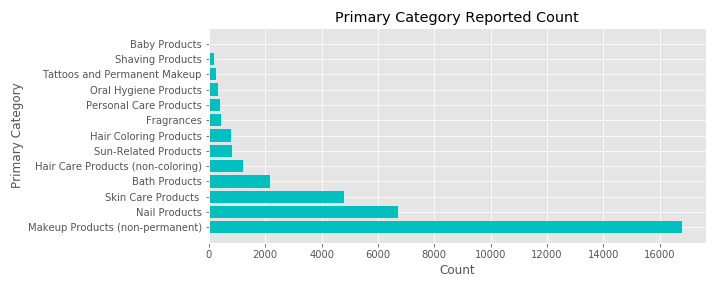
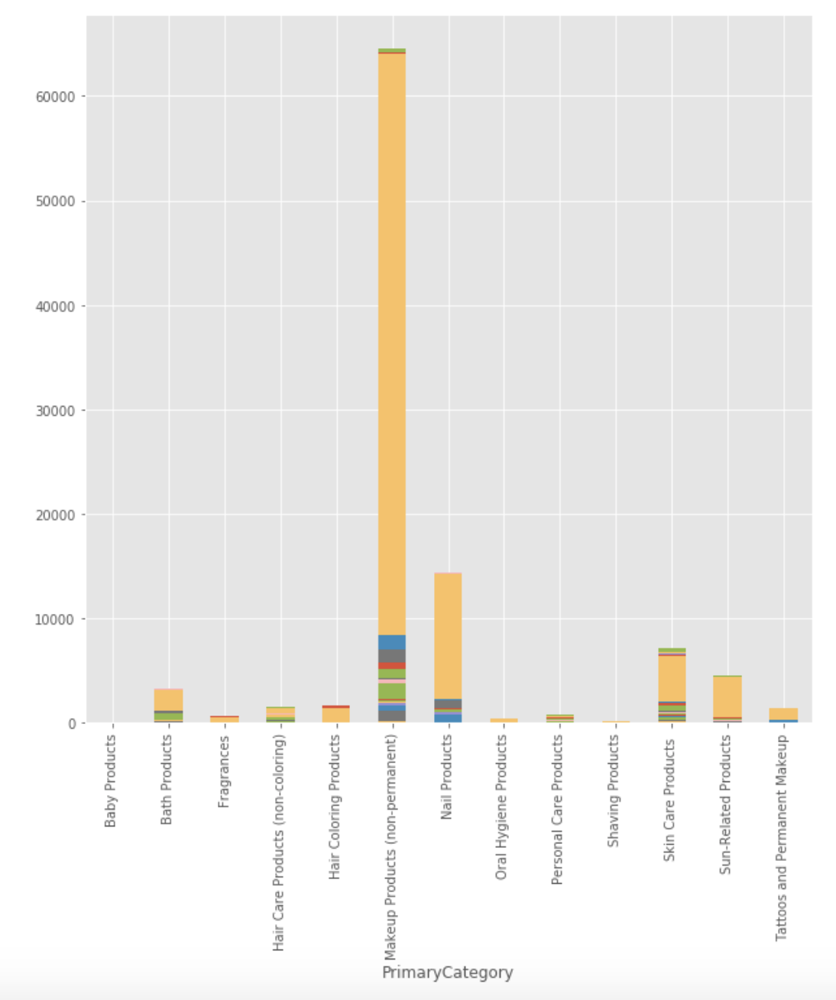
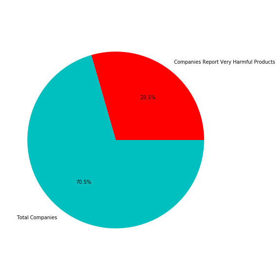
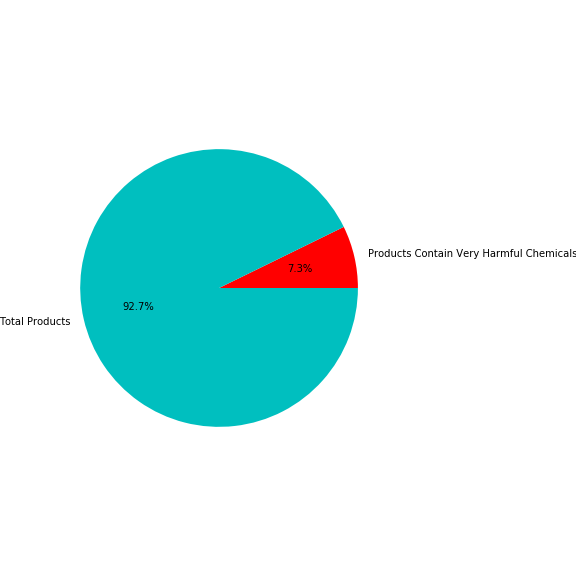
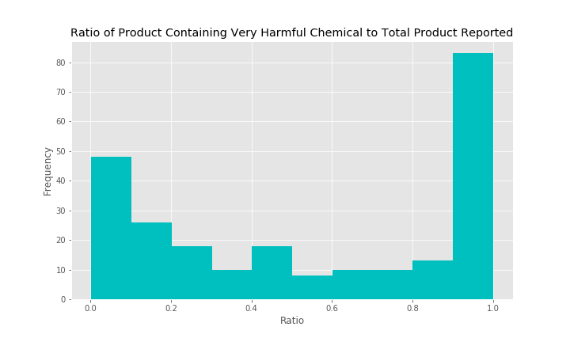

# WhatsOnYourFace

**Presentation Link: https://docs.google.com/presentation/d/1WirouORE1BTJmqjE8Qd94nHhls4L0t5KmRRavSkZqW8/edit#slide=id.p **

## Motivation
As a data scientist who loves cosmetics, I would like to utilize my skills in finding out harmful chemicals in cosmetic products sold in California. I would like to further explore if one chemical is more harmful than the other and if there are any brands or companies that have higher chance of using very harmful chemicals ingredients more than others

## Data
The Chemicals in Costmetics dataset reflect information that has been reported from 2009-2019 to California Safe Cosmetics Program. It includes more than 100,000 inputs of cosmetics containing ingredients linked to cancer or reproductive harm reported.

The table consists of 20 columns but interested in examining the following columns:
- CDPHId (Product ID) 
- ProductName 
- CSF (Color/Scent/Flavor)
- Primary Category
- Chemical Name
- Chemical Count

**Please note that each product can be input multiple times if it has more than one scent/flavor/color or more than one chemicals

## Workflow and EDA
- Import data to pandas data frame and clean

- Determine the most reported chemical

Titanium dioxide comes up really high. 

- Find out the most reported primary categories. To answer this, I grouped the data by the product id and primary category and plot the bar graph. 

- Most reported chemical by primary categories

Yellow block refers to Titanium Dioxide. This evidently shows that Titanium Dioxide has been reported the most across all primary categories. However, this triggers a question if Titanium Dioxide is actually very harmful or not.

After some research on this chemical, I discovered that Titanium Dioxide is actually FDA approved. Although it is considered harmful, but there are other chemicals that are much more compared to it.  

-  Next step I did was to categorize chemicals into VERY HARMFUL or not according to World Health Organization's list of 10 chemicals of major concerns even with low amount of exposure. I combined this list with Dirty Dozen ingredients investigated in Suzuki Foundation
    - total of 2729 products contain **very harmful** chemicals out of 34908 reported products
    - total of 244 companies reported products contain **very harmful** chemical out of 584 reported companies

- Calculating ratio very harmful product to total products reported for each company

The histogram shows that there are a good number of companies that has ratio of 1. For example Mckesson Medical-Surgical only report 12 products. However, all of those 12 products contain **Very Harmful** chemicals. On the other hands, some company report ------- So I would like to find out if there is a stitiscal signifinicant difference in 2 companies

## Hypothesis Testing

I would like to find out 
**if there is a stitistical significant difference the ratio of products contain very harmful chemicals to all products reported between 2 companies**

I am interested in comparing 2 companies in each test. The 2 companies are chosen based on their charateristic for example competitor companies, completely opposite company type (low end vs high end)